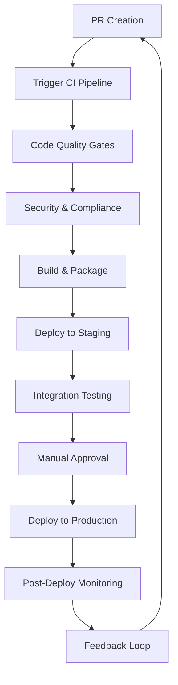
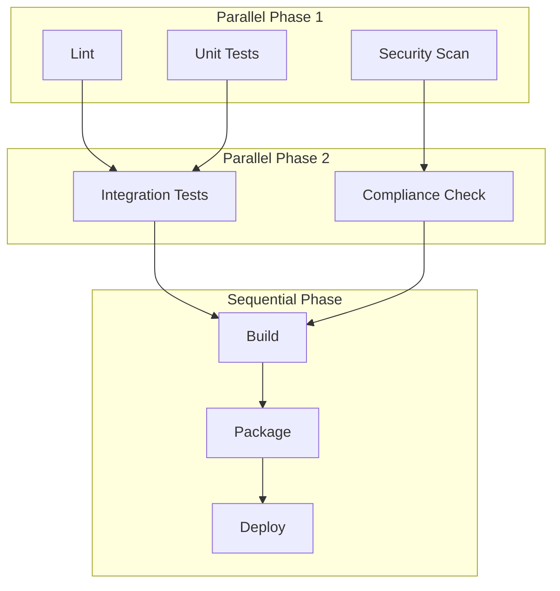
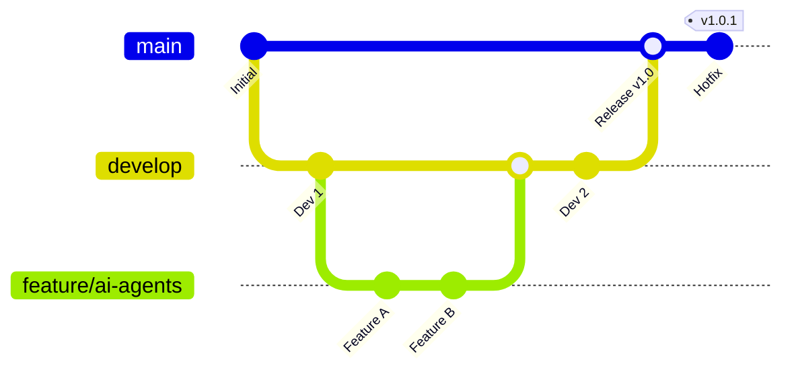

# CI/CD Pipeline Architecture & Design

## Overview

This document outlines the comprehensive CI/CD pipeline architecture for the CircuitTelligence platform, providing a structured approach to continuous integration, delivery, and deployment workflows. The architecture is designed to support multiple languages, frameworks, and deployment environments while maintaining high standards for code quality, security, and compliance.

## 1. Annotated High-Level CI/CD Pipeline Workflow

### Pipeline Stages Overview



### Detailed Workflow Steps

#### Stage 1: Pull Request Creation
- **Trigger**: Developer creates PR against target branch
- **Actions**: 
  - Branch protection rules validate PR requirements
  - Initial automated checks for file changes
  - Code ownership validation via CODEOWNERS
- **Outputs**: PR validation status, reviewers assignment

#### Stage 2: CI Pipeline Trigger
- **Trigger**: PR creation/update, push to protected branches
- **Actions**:
  - Webhook triggers pipeline execution
  - Environment setup and dependency resolution
  - Parallel job scheduling based on change detection
- **Outputs**: Pipeline execution ID, job queue status

#### Stage 3: Code Quality Gates
- **Trigger**: Successful pipeline initialization
- **Actions**:
  - Linting and code formatting validation
  - Unit and integration testing
  - Code coverage analysis
  - Static code analysis
- **Outputs**: Quality metrics, test results, coverage reports

#### Stage 4: Security & Compliance
- **Trigger**: Passing quality gates
- **Actions**:
  - Dependency vulnerability scanning
  - SAST (Static Application Security Testing)
  - License compliance validation
  - Secret detection and prevention
- **Outputs**: Security reports, compliance attestations

#### Stage 5: Build & Package
- **Trigger**: Security validation success
- **Actions**:
  - Artifact compilation and optimization
  - Container image building and scanning
  - Package generation and signing
  - Artifact storage and versioning
- **Outputs**: Deployable artifacts, container images, packages

#### Stage 6: Deploy to Staging
- **Trigger**: Successful artifact creation
- **Actions**:
  - Infrastructure provisioning/validation
  - Blue-green deployment execution
  - Configuration management application
  - Service health verification
- **Outputs**: Staging environment status, deployment logs

#### Stage 7: Integration Testing
- **Trigger**: Successful staging deployment
- **Actions**:
  - End-to-end testing execution
  - Performance and load testing
  - API contract validation
  - Cross-service integration verification
- **Outputs**: Test results, performance metrics, integration reports

#### Stage 8: Manual Approval (Production)
- **Trigger**: Successful staging validation
- **Actions**:
  - Stakeholder review and approval
  - Change management documentation
  - Deployment scheduling coordination
- **Outputs**: Approval status, deployment authorization

#### Stage 9: Deploy to Production
- **Trigger**: Manual approval completion
- **Actions**:
  - Production infrastructure validation
  - Canary/rolling deployment execution
  - Real-time monitoring activation
  - Rollback preparation
- **Outputs**: Production deployment status, monitoring alerts

#### Stage 10: Post-Deploy Monitoring
- **Trigger**: Production deployment completion
- **Actions**:
  - Application performance monitoring
  - Error rate and latency tracking
  - Business metrics validation
  - User experience monitoring
- **Outputs**: Performance dashboards, alert notifications

#### Stage 11: Feedback Loop
- **Trigger**: Continuous monitoring data
- **Actions**:
  - Metric aggregation and analysis
  - Issue identification and prioritization
  - Improvement recommendations generation
  - Knowledge base updates
- **Outputs**: Performance insights, optimization recommendations

## 2. CI Job Structure and Execution Order

### Job Dependency Matrix



### Job Definitions

#### 1. Lint Job
- **Purpose**: Code style and formatting validation
- **Tools**: ESLint, Pylint, golangci-lint, Prettier
- **Execution Time**: ~2-5 minutes
- **Failure Impact**: Blocks pipeline progression

#### 2. Unit Test Job
- **Purpose**: Component-level testing and code coverage
- **Tools**: pytest, Jest, Go test, coverage.py
- **Execution Time**: ~5-15 minutes
- **Coverage Threshold**: 80% minimum

#### 3. Security Scan Job
- **Purpose**: Vulnerability detection and security analysis
- **Tools**: Snyk, OWASP ZAP, Bandit, gosec
- **Execution Time**: ~3-10 minutes
- **Failure Impact**: Critical vulnerabilities block pipeline

#### 4. Integration Test Job
- **Purpose**: Service-to-service and API testing
- **Tools**: Postman/Newman, pytest-integration, Testcontainers
- **Execution Time**: ~10-30 minutes
- **Dependencies**: Database, external service mocks

#### 5. Compliance Check Job
- **Purpose**: License, policy, and regulatory compliance
- **Tools**: FOSSA, PolicyBot, custom compliance validators
- **Execution Time**: ~2-8 minutes
- **Artifacts**: Compliance reports, license inventories

#### 6. Build Job
- **Purpose**: Artifact compilation and optimization
- **Tools**: Docker, webpack, Go build, pip wheel
- **Execution Time**: ~5-20 minutes
- **Outputs**: Optimized binaries, static assets

#### 7. Package Job
- **Purpose**: Container image creation and registry push
- **Tools**: Docker Buildx, Helm, npm publish
- **Execution Time**: ~3-15 minutes
- **Outputs**: Tagged container images, Helm charts

#### 8. Deploy Job
- **Purpose**: Environment deployment and validation
- **Tools**: Kubernetes, Terraform, Ansible
- **Execution Time**: ~5-25 minutes
- **Strategy**: Blue-green, canary, or rolling deployment

## 3. Branch and Environment Strategy

### Branch Strategy



### Branch Protection and Policies

#### Main Branch (`main`)
- **Protection**: Require PR reviews (2+ approvers)
- **Checks**: All CI jobs must pass
- **Deployment**: Triggers production deployment
- **Merge Strategy**: Squash and merge

#### Development Branch (`develop`)
- **Protection**: Require PR reviews (1+ approver)
- **Checks**: Core CI jobs must pass
- **Deployment**: Triggers staging deployment
- **Merge Strategy**: Merge commit

#### Feature Branches (`feature/*`)
- **Protection**: Basic CI validation
- **Checks**: Lint, unit tests, security scan
- **Deployment**: Development environment (optional)
- **Merge Strategy**: Squash and merge to develop

### Environment Mapping

#### Development Environment
- **Trigger**: Feature branch pushes
- **Purpose**: Early integration testing
- **Resources**: Minimal, shared resources
- **Data**: Synthetic test data
- **Monitoring**: Basic logging and metrics

#### Staging Environment
- **Trigger**: Develop branch updates
- **Purpose**: Pre-production validation
- **Resources**: Production-like configuration
- **Data**: Anonymized production data
- **Monitoring**: Full monitoring stack

#### Production Environment
- **Trigger**: Main branch updates (with approval)
- **Purpose**: Live user-facing services
- **Resources**: High availability, auto-scaling
- **Data**: Live production data
- **Monitoring**: Comprehensive observability

## 4. Tooling Matrix

### Supported Languages and Frameworks

| Language | Frameworks | Test Tools | Build Tools | Package Format |
|----------|------------|------------|-------------|----------------|
| Python | FastAPI, LangChain, Django, Flask | pytest, unittest | pip, poetry, setuptools | wheel, conda |
| TypeScript/JavaScript | React, Node.js, Express, Next.js | Jest, Mocha, Cypress | npm, yarn, webpack, Vite | npm package, Docker |
| Go | Gin, Echo, gRPC | go test, testify | go build, goreleaser | binary, Docker |
| Rust | Axum, Tokio, Actix | cargo test | cargo build | crate, binary |
| Java | Spring Boot, Quarkus | JUnit, TestNG | Maven, Gradle | JAR, Docker |

### CI/CD Infrastructure

#### Runners and Environments
- **GitHub Actions**: Primary CI/CD orchestration
- **Self-Hosted Runners**: High-performance, secure builds
- **Container Environments**: Docker, Kubernetes
- **Cloud Providers**: AWS, GCP, Azure support

#### Artifact Storage
- **Container Registry**: GitHub Container Registry, ECR, GCR
- **Package Repositories**: npm, PyPI, Maven Central
- **Binary Storage**: GitHub Releases, S3, GCS
- **Helm Charts**: GitHub Pages, ChartMuseum

#### Monitoring and Observability
- **Metrics**: Prometheus, DataDog, New Relic
- **Logging**: ELK Stack, Fluentd, CloudWatch
- **Tracing**: Jaeger, Zipkin, AWS X-Ray
- **Alerting**: PagerDuty, Slack, OpsGenie

## 5. AI/Agent Integration Points

### Current Architecture Preparation

The CI/CD pipeline is designed with extensibility points to accommodate AI and autonomous agent workflows:

#### 5.1 AI-Enhanced Build Processes

**Placeholder: AI Code Generation Pipeline**
```yaml
# Future AI Integration Point
ai_build_enhancement:
  - code_generation_validation
  - automated_test_generation  
  - intelligent_optimization
  - dependency_recommendation
```

**Implementation Readiness**:
- Webhook endpoints for AI service integration
- Artifact storage for AI-generated code and tests
- Quality gates adapted for AI-generated content
- Rollback mechanisms for AI-assisted changes

#### 5.2 Intelligent Testing and Validation

**Placeholder: AI Test Orchestration**
```yaml
# Future AI Testing Integration
ai_test_enhancement:
  - smart_test_selection
  - automated_edge_case_generation
  - performance_prediction
  - failure_pattern_analysis
```

**Integration Points**:
- Test result analysis pipeline hooks
- Machine learning model artifact management
- Predictive failure detection endpoints
- Automated test case generation triggers

#### 5.3 Autonomous Deployment Strategies

**Placeholder: AI-Driven Deployment**
```yaml
# Future Autonomous Deployment
ai_deployment_enhancement:
  - risk_assessment_automation
  - optimal_deployment_timing
  - automated_rollback_decisions
  - capacity_planning_optimization
```

**Architectural Considerations**:
- Decision logging for AI-driven deployment choices
- Human approval override mechanisms
- AI model versioning and deployment
- Explainable AI integration for deployment decisions

#### 5.4 Continuous Monitoring and Feedback

**Placeholder: AI Monitoring Integration**
```yaml
# Future AI Monitoring Enhancement
ai_monitoring_enhancement:
  - anomaly_detection_automation
  - predictive_scaling
  - intelligent_alerting
  - automated_incident_response
```

**Integration Framework**:
- Real-time data streaming to AI services
- Model inference API integration
- Automated remediation action triggers
- Continuous learning feedback loops

### AI/Agent Workflow Extension Points

#### Code Quality Enhancement
- **AI Code Review**: Automated code quality suggestions
- **Security Analysis**: ML-powered vulnerability detection
- **Performance Optimization**: AI-driven code optimization recommendations

#### Deployment Intelligence
- **Risk Assessment**: ML models for deployment risk evaluation
- **Capacity Planning**: AI-powered resource allocation
- **User Impact Prediction**: Intelligent change impact analysis

#### Operational Intelligence
- **Predictive Maintenance**: Proactive issue identification
- **Auto-remediation**: Autonomous incident response
- **Optimization Recommendations**: Continuous improvement suggestions

## Conclusion

This CI/CD pipeline architecture provides a robust foundation for modern software development practices while maintaining flexibility for future AI and automation enhancements. The design emphasizes security, compliance, and operational excellence while preparing for intelligent automation integration.

The architecture supports multiple programming languages and frameworks commonly used in modern development, with clear extension points for AI-driven enhancements across build, test, deployment, and monitoring workflows.

### Next Steps

1. **Implementation Planning**: Prioritize pipeline components based on current project requirements
2. **Tool Selection**: Finalize specific tool choices based on organizational preferences and constraints
3. **AI Integration Roadmap**: Develop timeline for implementing AI-enhanced pipeline features
4. **Monitoring Strategy**: Establish baseline metrics and alerting thresholds
5. **Documentation Updates**: Maintain living documentation as pipeline evolves

---

*This document serves as the foundational architecture for the CircuitTelligence CI/CD pipeline and will be updated as the platform evolves and new technologies are integrated.*
