# Quasar Tabula - Home Network Architecture

## Overview

**Codename**: Quasar Tabula  
**Purpose**: Comprehensive home network topology and architecture documentation  
**Target Environment**: Modern smart home with IoT devices, security systems, and high-performance computing needs

This document outlines the complete network architecture for a sophisticated home network setup, designed with intelligence-first principles and circuit reliability in mind, following the Circuittelligence doctrine.

## Network Topology

### Primary Network Architecture

```mermaid
graph TB
    subgraph "Internet Provider"
        ISP[Internet Service Provider]
        FIBER[Fiber Optic Connection<br/>1Gbps]
    end
    
    subgraph "Entry Point & Security"
        MODEM[Cable/Fiber Modem<br/>Bridge Mode]
        FIREWALL[Security Firewall<br/>pfSense/OPNsense]
        UPS1[UPS - Network Core<br/>1500VA]
    end
    
    subgraph "Core Network Infrastructure"
        ROUTER[Core Router<br/>Enterprise Grade]
        SWITCH_CORE[Core Switch<br/>24-Port Gigabit<br/>PoE+ Capable]
        SWITCH_POE[PoE Switch<br/>16-Port<br/>Security Cameras]
        AP_MAIN[Main WiFi AP<br/>WiFi 6E<br/>Ceiling Mounted]
        AP_EXT[WiFi Extender<br/>WiFi 6<br/>Basement/Garage]
    end
    
    subgraph "Network Zones"
        subgraph "Management VLAN 10"
            MGMT[Network Management<br/>192.168.10.0/24]
            NMS[Network Monitoring<br/>PRTG/LibreNMS]
        end
        
        subgraph "Trusted VLAN 20"
            TRUSTED[Trusted Devices<br/>192.168.20.0/24]
            DESKTOP[Desktop PCs]
            LAPTOP[Laptops]
            WORKSTATION[Workstation<br/>High-Performance]
        end
        
        subgraph "IoT VLAN 30"
            IOT[IoT Devices<br/>192.168.30.0/24]
            SMART_TV[Smart TVs]
            ALEXA[Voice Assistants]
            LIGHTS[Smart Lighting]
            THERMOSTAT[Smart Thermostat]
        end
        
        subgraph "Guest VLAN 40"
            GUEST[Guest Network<br/>192.168.40.0/24]
            GUEST_WIFI[Guest WiFi Access]
        end
        
        subgraph "Security VLAN 50"
            SECURITY[Security Systems<br/>192.168.50.0/24]
            CAMERAS[IP Cameras]
            DVR[Network Video Recorder]
            SENSORS[Motion Sensors]
        end
        
        subgraph "Server VLAN 60"
            SERVERS[Server Infrastructure<br/>192.168.60.0/24]
            NAS[Network Attached Storage<br/>RAID 6 Configuration]
            HOMELAB[Home Lab Server<br/>Virtualization Host]
            MEDIA[Media Server<br/>Plex/Jellyfin]
        end
    end
    
    subgraph "External Services"
        CLOUD[Cloud Services<br/>Backup & Sync]
        VPN_PROVIDER[VPN Provider<br/>Privacy Protection]
        DNS_EXTERNAL[External DNS<br/>Cloudflare/Quad9]
    end
    
    %% Connections
    ISP --> FIBER
    FIBER --> MODEM
    MODEM --> FIREWALL
    FIREWALL --> ROUTER
    ROUTER --> SWITCH_CORE
    SWITCH_CORE --> SWITCH_POE
    SWITCH_CORE --> AP_MAIN
    SWITCH_CORE --> AP_EXT
    
    %% Power
    UPS1 -.->|Power| MODEM
    UPS1 -.->|Power| FIREWALL
    UPS1 -.->|Power| ROUTER
    UPS1 -.->|Power| SWITCH_CORE
    
    %% VLAN Connections
    ROUTER --> MGMT
    ROUTER --> TRUSTED
    ROUTER --> IOT
    ROUTER --> GUEST
    ROUTER --> SECURITY
    ROUTER --> SERVERS
    
    %% Device Connections
    SWITCH_CORE --> DESKTOP
    SWITCH_CORE --> WORKSTATION
    SWITCH_CORE --> NAS
    SWITCH_CORE --> HOMELAB
    SWITCH_CORE --> MEDIA
    SWITCH_CORE --> DVR
    
    SWITCH_POE --> CAMERAS
    AP_MAIN --> LAPTOP
    AP_MAIN --> SMART_TV
    AP_MAIN --> ALEXA
    AP_MAIN --> LIGHTS
    AP_MAIN --> THERMOSTAT
    AP_EXT --> SENSORS
    
    %% External Connections
    FIREWALL --> CLOUD
    FIREWALL --> VPN_PROVIDER
    FIREWALL --> DNS_EXTERNAL
    
    %% Styling
    classDef internetClass fill:#e1f5fe
    classDef securityClass fill:#ffebee
    classDef coreClass fill:#f3e5f5
    classDef vlanClass fill:#e8f5e8
    classDef deviceClass fill:#fff3e0
    classDef serverClass fill:#e0f2f1
    
    class ISP,FIBER internetClass
    class FIREWALL,UPS1 securityClass
    class ROUTER,SWITCH_CORE,SWITCH_POE,AP_MAIN,AP_EXT coreClass
    class MGMT,TRUSTED,IOT,GUEST,SECURITY,SERVERS vlanClass
    class DESKTOP,LAPTOP,WORKSTATION,SMART_TV,ALEXA,LIGHTS,THERMOSTAT,CAMERAS,DVR,SENSORS deviceClass
    class NAS,HOMELAB,MEDIA,NMS serverClass
```

## Network Specifications

### Infrastructure Components

#### Core Networking
- **Router**: Enterprise-grade with VLAN support, BGP capability
- **Core Switch**: 24-port Gigabit with PoE+ (240W total power budget)
- **PoE Switch**: 16-port dedicated for security cameras and sensors
- **Wireless Access Points**: WiFi 6E main AP, WiFi 6 extender

#### Power Management
- **UPS Systems**: 1500VA for network core, 1000VA for servers
- **Power Budget**: PoE devices calculated within switch capacity
- **Backup Power**: 30-minute runtime for graceful shutdown

#### Security Infrastructure
- **Firewall**: pfSense or OPNsense with IDS/IPS capabilities
- **Network Segmentation**: 6 VLANs with inter-VLAN firewall rules
- **Monitoring**: Continuous network traffic analysis

### VLAN Configuration

| VLAN ID | Name | Subnet | Purpose | Access Rules |
|---------|------|--------|---------|--------------|
| 10 | Management | 192.168.10.0/24 | Network infrastructure management | Admin access only |
| 20 | Trusted | 192.168.20.0/24 | Personal computers and trusted devices | Full internet access |
| 30 | IoT | 192.168.30.0/24 | Smart home devices | Restricted internet, no inter-VLAN |
| 40 | Guest | 192.168.40.0/24 | Guest device access | Internet only, isolated |
| 50 | Security | 192.168.50.0/24 | Security cameras and systems | Local recording, limited internet |
| 60 | Servers | 192.168.60.0/24 | Server infrastructure | Controlled access, specific ports |

## Security Considerations

### Network Security
- **Firewall Rules**: Deny-by-default with explicit allow rules
- **VLAN Isolation**: Prevents lateral movement between network segments
- **Access Control**: MAC address filtering for critical devices
- **VPN Access**: Secure remote access to management network

### Monitoring and Alerting
- **Network Monitoring**: Real-time traffic analysis and alerting
- **Intrusion Detection**: Automated threat detection and response
- **Log Management**: Centralized logging with retention policies
- **Performance Monitoring**: Bandwidth usage and device health tracking

## Device Inventory

### Critical Infrastructure
- 1x Enterprise Router (VLAN support, BGP capable)
- 1x 24-port Gigabit PoE+ Switch
- 1x 16-port PoE Security Switch
- 2x WiFi 6/6E Access Points
- 1x Network Firewall Appliance
- 2x UPS Systems (1500VA, 1000VA)

### End Devices
- 3-5x Desktop/Workstation Computers
- 4-8x Laptops and Mobile Devices
- 8-12x IP Security Cameras
- 1x Network Video Recorder (NVR)
- 15-20x IoT Smart Home Devices
- 1x High-Capacity NAS (4-8 bay)
- 1x Home Lab Server (Virtualization)

## Performance Specifications

### Bandwidth Allocation
- **ISP Connection**: 1Gbps fiber (symmetric)
- **Internal Backbone**: Gigabit Ethernet throughout
- **WiFi Capacity**: Up to 2.4Gbps aggregate (WiFi 6E)
- **PoE Power Budget**: 240W available for powered devices

### Quality of Service (QoS)
- **Priority 1**: Security cameras and monitoring
- **Priority 2**: Video conferencing and VoIP
- **Priority 3**: General computing and web browsing
- **Priority 4**: File transfers and backup operations
- **Priority 5**: Guest network and IoT devices

## Disaster Recovery

### Backup Strategies
- **Configuration Backup**: Automated router/switch config backup
- **Network Documentation**: Maintained in version control
- **Recovery Procedures**: Documented step-by-step restoration
- **Emergency Contacts**: ISP, equipment vendors, support personnel

### Business Continuity
- **Redundant Internet**: Secondary ISP connection option
- **Backup Power**: UPS systems with external generator capability
- **Critical Device Spares**: Key network components inventory
- **Remote Management**: Out-of-band management capabilities

## Implementation Timeline

### Phase 1: Core Infrastructure (Week 1-2)
- [ ] Install and configure firewall appliance
- [ ] Deploy core router and primary switch
- [ ] Establish VLAN configuration and basic security rules
- [ ] Install and test UPS systems

### Phase 2: Network Expansion (Week 3-4)
- [ ] Deploy WiFi access points and configure wireless networks
- [ ] Install PoE switch for security systems
- [ ] Configure network monitoring and alerting
- [ ] Implement QoS policies

### Phase 3: Device Integration (Week 5-6)
- [ ] Connect and configure all end devices
- [ ] Deploy security cameras and recording systems
- [ ] Integrate IoT devices with appropriate network segmentation
- [ ] Test all inter-VLAN communication rules

### Phase 4: Optimization (Week 7-8)
- [ ] Performance testing and optimization
- [ ] Security hardening and penetration testing
- [ ] Documentation completion and user training
- [ ] Disaster recovery testing

## Maintenance Schedule

### Daily
- Monitor network performance and alerts
- Check critical device status
- Review security logs

### Weekly
- Update firmware on critical devices
- Backup network configurations
- Review bandwidth utilization reports

### Monthly
- Physical inspection of network equipment
- Update network documentation
- Security policy review and updates

### Quarterly
- Comprehensive security audit
- Disaster recovery test execution
- Performance optimization review

---

## Circuittelligence Doctrine Alignment

This network architecture exemplifies the core Circuittelligence principles:

- **Intelligence-First**: Comprehensive monitoring and automated decision-making
- **Circuit Reliability**: Redundant power, UPS backup, and enterprise-grade equipment
- **Collaborative Excellence**: Clear documentation, standardized procedures, and shared access controls

The Quasar Tabula network design provides a robust foundation for modern smart home operations while maintaining security, performance, and scalability for future expansion.

---

**Built with Circuittelligence Doctrine** 🔬⚡  
*Empowering intelligent home networking through structured excellence*